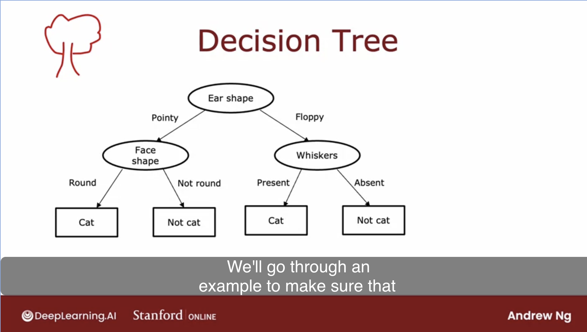

# Week 4

- Decision Trees
    - Forward Prediction works like a Tree
        - Start at the root note and choose to go to any of the children
        - Here's an example:
            
    - Learning Questions
        - How do you decide which feature to split on?
            - Intuitively you want to pick the node that will most cleanly split your data, so that each side is classified differently
        - When do you decide to stop splitting?
            - Could be when 100% of examples are of one category
            - Could be once the tree hits a certain depth, so as to avoid being too large and thus create overfitting

- Entropy
    - Measure of how "pure" your dataset is
    - $$
        p_1 = \text{Fraction of samples labeled as 1}
        \newline
        H(p_1) = -p_1log_2(p_1) - (1 - p_1)log_2(1 - p_1)
      $$
    - Information gain
        - What is the reduction in entropy by splitting the data on some feature
        - $$
            w^{left} = \text{fraction of total examples in the left}
            \newline
            w^{right} = \text{fraction of total examples in the right}
            \newline
            = H(p_1^{root}) - (w^{left}H(p_1^{left}) + w^{right}H(p_1^{right}))
          $$ 

- Learning Process
    - Pick the feature that gives you the highest information gain
    - Split the data based on that
    - Recurse on the children, unless you hit a stopping criteria, which could be one of the following:
        - Hitting a certain max depth
        - All the data being pure in a child
        - Not having enough examples in one of the children
    - For categorical values (think enums), use one hot encoding to break down the problem back into the normal decision tree learning algorithm
    - For continuous values, pick a threshold value to split on
        - i.e. if $weight \leq threshold $
        - You'll need to try multiple thresholds, pick the one that gives the highest information gain
        - Then compare to all the other features as before
