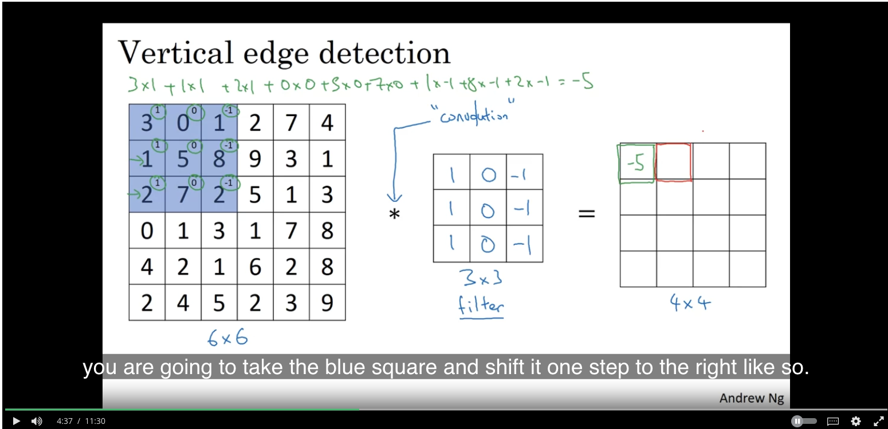
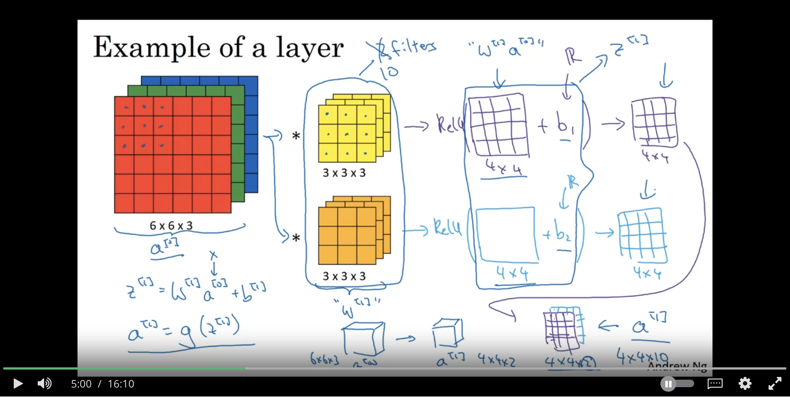
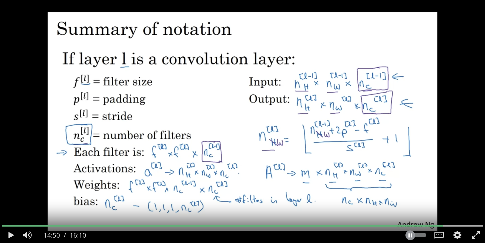

# Foundations of Convoluational Neural Networks

## Convolutional Neural Networks
* In computer vision, we want to be able to use large images. But if we feed each pixel of the input as a parameter to the ML model, we'll have to train way too many parameters
* Convolution operator:
  * Notation is $*$ (same as multiplication)
  * Think of this like applying a "filter" to the matrix
  * Example:
  
  * The example is a vertical edge detector (because of the filter)
    * You can flip the "Filter" matrix 90 degrees and get a horizontal edge detector
    * You can use deep learning to figure out 9 random numbers to learn to even detect 45 degree or 70 degree edges
* Padding
  * Notice that the output in the example is 4x4
  * If you have a n x n image, and an f x f filter, the result is a (n - f + 1, n - f + 1) image
  * To counteract this you can pad the input image all around to make sure it retains the same original size. This is called a "Same" convolution. 
  * If you do no padding, this is a "valid" convolution
* Strided convolutions
  * Instead of hopping over the input matrix one pixel at a time, you can take a stride of $s$ steps
  * This makes the final output matrix:
  $$
  (\lfloor \frac{n + 2p - f}{s} + 1 \rfloor, \lfloor \frac{n + 2p - f}{s} + 1 \rfloor)
  $$
* Convolutions over multiple dimensions
  * Normal images are (n, n, 3). You can convolve this with a (f, f, 3) matrix. The 3's at the end have to be the same:
    * This gives a 2D matrix with the following dimensions:
    $$
    (\lfloor \frac{n + 2p - f}{s} + 1 \rfloor, \lfloor \frac{n + 2p - f}{s} + 1 \rfloor)
    $$
    * If you apply multiple convolutions, you can add them in different layers. So if applying multiple convolutions, you'll have an output matrix of the size:
    $$
    (\lfloor \frac{n + 2p - f}{s} + 1 \rfloor, \lfloor \frac{n + 2p - f}{s} + 1 \rfloor, n_{c'})
    $$
    * Where $n_{c'}$ is the number of convolution filters applied
* Single layer of a convolutional neural network
  * You can think of the filter in the convolution operator as part of $W^{[l]}$. More concretely, look at this example:
    
  * Notation
  