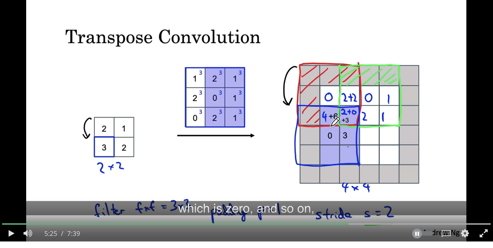

## Detection Algorithms
* There's 3 types of detection problems
  * Image classification: Does the item exist in the image
  * Image classification with localization: Does the item exist in the image, and it's location
  * Detection: Detect positions of multiple items in the image
* Localization output:
  * Array of $[p_c, b_x, b_y, b_w, b_h, c_1, ..., c_n]$
    * $p_c$ is if the object exists or not in the output
    * $b_x, b_y, b_w, b_h$ is the location of the image
    * $c_1,...,c_n$ is 0/1 if the class exists in the image
  * Computing loss:
    * If there's any object in the image:
      * $ Loss = (\hat{y}_1 - y_1)^2$
    * If there's no object in the image:
      * $Loss = \sum_{i= 1}^{n}(\hat{y}_i - y_i)^2$
* Landmark detection
  * Actually similar to Localization. Just drop the $c_1, ..., c_n$ from the output
  * Each landmark that you identify has to be consistent across the entire set of training data. In other works, $l_1$ should always refer to the left corner of someone's eye as an example
* Object Detection
  * At a high level, you can use something like a "Sliding window algorithm"
    * You just pass in small crops of multiple sections of the image and have it predict "Is there an object in this image or not"
    * Your training set will have the images of the objects closely cropped
    * This can be computationally expensive
  * You can speed this up by doing this computation "Convolutionally"
    * Instead of the flattened and fully connected layers at the end. You can represent these as convolution operations with:
      * The flattened layer being represented as a conv layer with filters of size $(n_{in}, n_{out}, n_{num units})$
      * The FC Layers as a bunch of 1x1 filters
    * This allows you to reuse computations since you can just pass the larger image once and the sections of each output predict the result for a cropped region
  * YOLO Algorithm
    * At a high level, chunk the image into nxn grids. Run localization on each of the sub images
      * The bounding box predictions will have $b_x, b_y$ between 0 and 1. $b_h, b_w$ can be greater than 1
    * The algorithm is still efficient because we can run these computations convolutionally to compute shared parameters more efficiently
    * Intersection over Union (IoU)
      * Used to help evaluate how well localization is doing
      * Compute the intersection of the bounding boxes (predicted vs actual)over the union of the bounding boxes
        * If it's close to 1, then that's great
      * Used in non-max suppression. The logic of which can be described as:
        * Discard all bounding boxes with $p_c$ below some threshold
        * Repeat while there are remaining boxes:
          * Pick the box with the highest $p_c$
          * Remove any boxes that intersect with the picked box
    * Anchor boxes
      * In the output for the training set, you can output "Anchor box" predictions. So it's like predicting for multiple classes
        * So predicting $y$ is something like $[p_c, b_x, b_y, b_w, b_h, c_1, ..., c_n, p_c, b_x, b_y, b_w, b_h, c_1, ..., c_n]$
        * It can help solve the case of multiple objects having their same midpoint in the same cell
        * It also helps the algorithm specialize better
    * It's common to use transfer learning with these types of large models since they take a long time to train
  * Semantic segmentation
    * Instead of just drawing a bounding box around an interesting area, label every single pixel in the output. 
    * To do this, you use a U-Net architecture. 
      * Transpose convolution
        * Lets you take a small input, a larger filter and results in a larger height and width output
        
      * U-Net Architecture
        * You have a bunch of normal CONV layers. These shrink the height and width but increase the channels
        * These are then passed to transpose convolution layers which blow it back up to the original image size
        * There's also skip connections between the CONV layers and the expansion layers to fill in more granular information
        * Final output is a matrix of $(h, w, n_c)$, where $n_c$ is the number of output classes
