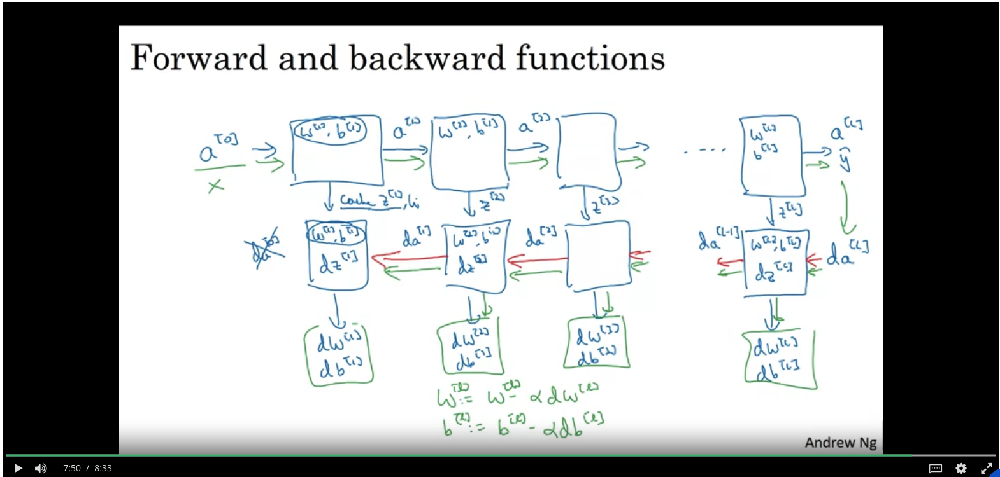

## Deep Neural Network

* Notation
  * $L$ = number of layers in the neural network
  * $n^{[l]}$ is the number of units in layer $l$
  * $A^{[l]}$ is the activation output for layer $l$ for each example stacked horizontally
    * So it looks like:
    $$
    [A^{[l](1)}, A^{[l](2)}, A^{[l](3)} ...A^{[l](m)}]
    $$

* General rule for activations for layer $l$
$$
z^{[l]} = W^{[l]}a^{[l - 1]} + b^{[l]}
$$
$$
a^{[l]} = g^{[l]}(z^{[l]})
$$

* Pro Tip: Make sure matrix dimensions make sense to avoid bugs
  * Dimensions of $W^{[l]}$ have to be $(n^{[l]}, n^{[l - 1]})$
  * Dimensions of $b^{[l]}$ have to be $(n^{[l]}, 1)$
    * Broadcasting will help take care of working across multiple examples

* What's the intuition behind deep neural networks working better?
  * Early hidden layer computes a simple function and passes that info on
    * You learn more complex things the deeper you go into neural networks
  * To compute complicated things in a neural network, you'll also need to compute a shallow network with an exponentially large number of neurons per each layer

* How does backprop work with multiple layers?

  * Notice that values for $z^{[l]}$ are cached so they can be used in backprop
  * To compute the initial $da^{[L]}$, for the last layer it's based on the Loss function
  $$
  da^{[L]} = \frac{\partial{L(\hat{y}, y)}}{\partial{\hat{y}}} = -\frac{y}{a} + \frac{1 - y}{1 - a}
  $$

  $$
  a = \hat{y}
  $$

* Hyperparameters
  * Set of parameters used in the learning algorithm to learn the real parameters ($W$ and $b$)
  * Examples:
    * Learning rate $\alpha$
    * Number of iterations of gradient descent
    * Number of hidden layers $L$
    * Number of hidden units in each layer
  * Tweaking this is an experimental process. It's often something you just need to try out and see what works.
  