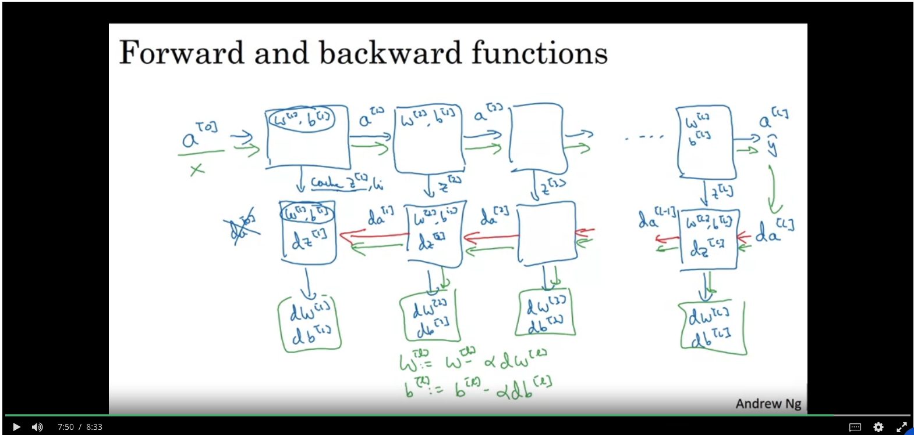

## Deep Neural Network

* Notation
  * $L$ = number of layers in the neural network
  * $n^{[l]}$ is the number of units in layer $l$

* General rule for activations for layer $l$
$$
z^{[l]} = W^{[l]}a^{[l - 1]} + b^{[l]}
$$
$$
a^{[l]} = g^{[l]}(z^{[l]})
$$

* Pro Tip: Make sure matrix dimensions make sense to avoid bugs
  * Dimensions of $W^{[l]}$ have to be $(n^{[l]}, n^{[l - 1]})$
  * Dimensions of $b^{[l]}$ have to be $(n^{[l]}), 1)$
    * Broadcasting will help take care of working across multiple examples

* What's the intuition behind deep neural networks working better?
  * Each hidden layer computes a simple function and passes that info on
    * You learn more complex things the deeper you go into neural networks
  * To compute complicated things in a neural network, you'll also need to compute a shallow network with a ton of neurons per each layer

* How does backprop work with multiple layers?

