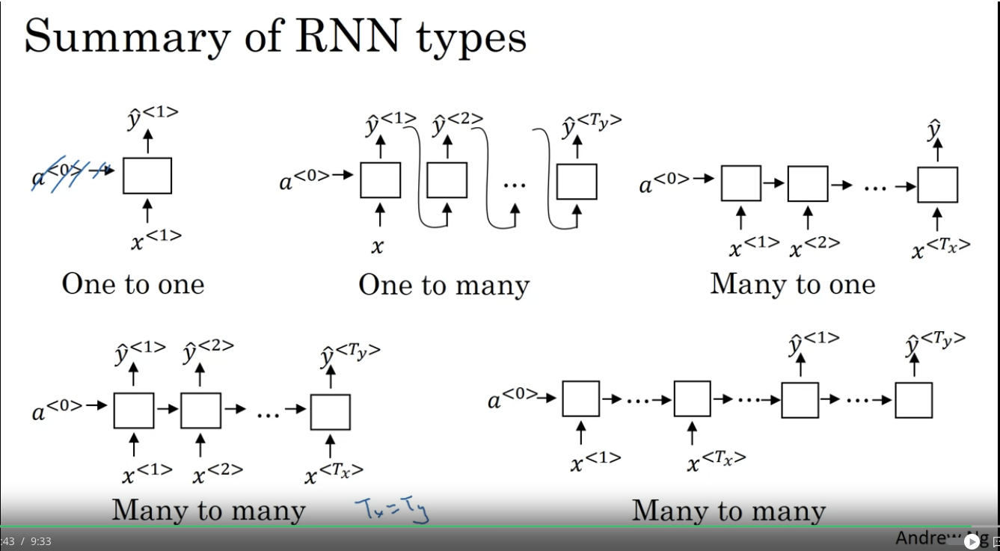
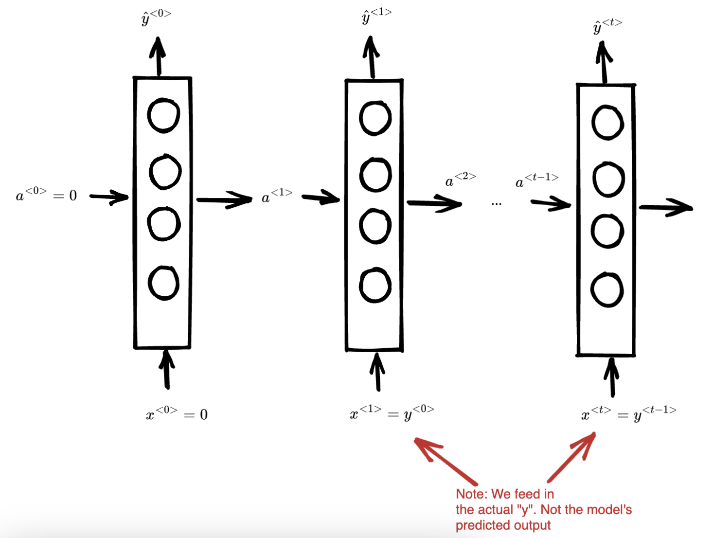

# Recurrent Neural Networks (RNN)
* Used when there's a sequence of input. Examples include:
  * Speech recognition, music recognition, sentiment analysis
* Notation
  * $x^{(i)<t>}$
    * Represents the $t$-th element of the $i$-th example of the training set
  * $T_x^{(i)}$
    * Represents the length of the sequence for the $i$-th example of the training set
  * Representing sequence data
    * Keep a dictionary of all possible words
    * Each word is represented as a one-hot encoded vector where it's 1 at the index of word in the dictionary 
* Why not use a traditional neural network for these cases?
  * Inputs and outputs can be of different lengths for different examples
  * Similar to ConvNets, learned parameters cannot be shared easily across different positions
* RNN Model
  
* Loss functions
  * $L^{<t>}(\hat{y}^{<t>}, y^{<t>}) = $ binary cross entropy
  * $L(\hat{y}, y) = \sum_t L^{<t>}(\hat{y}^{<t>}, y^{<t>})$
* Different RNN model architectures
  
* Language modelling
  * What is the probability of two "sentences". More formally:
    * $P(y^{<1>}, y^{<2>}, ..., y^{<t>}) = ?$
  * Training a language model:
    * Use a large corpus of training data. 
    * Tokenize the data (each word is a $x^{<t>}$)
    * For end of sentences and unknown words use \<EOS\> and \<UNK\> respectively
    * Use the following model:
      
    * Each $y^{<t>}$ is a softmax output of every single value in the dictionary
    * Loss function:
      $Loss = -\sum_t\sum_i y_i^{<t>}log(\hat{y}_i^{<t>})$
    * Use this model to generate probability of a sentence:
      * So for $P(y^{<1>},y^{<2>},y^{<3>})$
        * The first output gives the $P(y^{<1>})$, the second output gives $P(y^{<2>} | y^{<1>})$, the third gives the output $P(y^{<3>} | y^{<2>}, y^{<1>})$. You can multiply these 3 things together to get the full probability
    * You can also use the same language model architecture to generate novel sequences. The two main differences are:
      * Use the softmax probability distribution to pick a word for $\hat{y}^{<0>}$. 
      * Pass that into $x^{<1>}$ (instead of $y^{<0>}$)
* Vanishing gradient problem
  * RNNs suffer from this problem since it's a very deep neural network
  * So the gradients of the prediction don't affect earlier layers of the RNN as easily
  * Exploding gradients can also happen for a similar reason