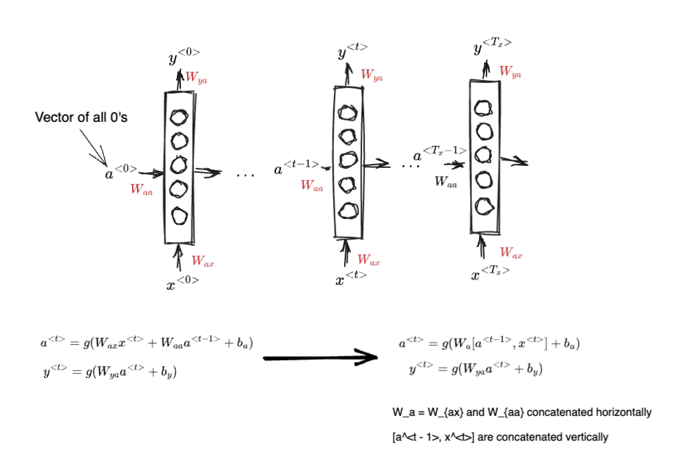

# Recurrent Neural Networks (RNN)
* Used when there's a sequence of input. Examples include:
  * Speech recognition, music recognition, sentiment analysis
* Notation
  * $x^{(i)<t>}$
    * Represents the $t$-th element of the $i$-th example of the training set
  * $T_x^{(i)}$
    * Represents the length of the sequence for the $i$-th example of the training set
  * Representing sequence data
    * Keep a dictionary of all possible words
    * Each word is represented as a one-hot encoded vector where it's 1 at the index of word in the dictionary 
* Why not use a traditional neural network for these cases?
  * Inputs and outputs can be of different lengths for different examples
  * Similar to ConvNets, learned parameters cannot be shared easily across different positions
* RNN Model
  
* Loss functions
  * $L^{<t>}(\hat{y}^{<t>}, y^{<t>}) = $ binary cross entropy
  * $L(\hat{y}, y) = \sum_t L^{<t>}(\hat{y}^{<t>}, y^{<t>})$
